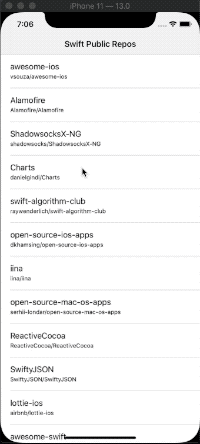

# GitHubPublicSwiftRepos

Display the list of ALL public repositories written using the Swift language

## Getting Started

### Prerequisites

- Xcode 11
- iOS13 as contributor details screens doesn't have any kind of dismissing buttons. It depends on swiping down which is produced from iOS13

### Installing

Swift Packages is used for package dependencies so there is no need to use cocoapods

## Usage

Clone then run :rocket::rocket:

## Demo

## Networking

Use native [Network Layer](https://github.com/marcinjackowski/NetworkLayer), thanks  [Marcin Jackowski](https://github.com/marcinjackowski) for such great work

## Architecture

- VIPER

## Library

- [Kingfisher](https://github.com/onevcat/Kingfisher)

## License

This project is licensed under the MIT License
